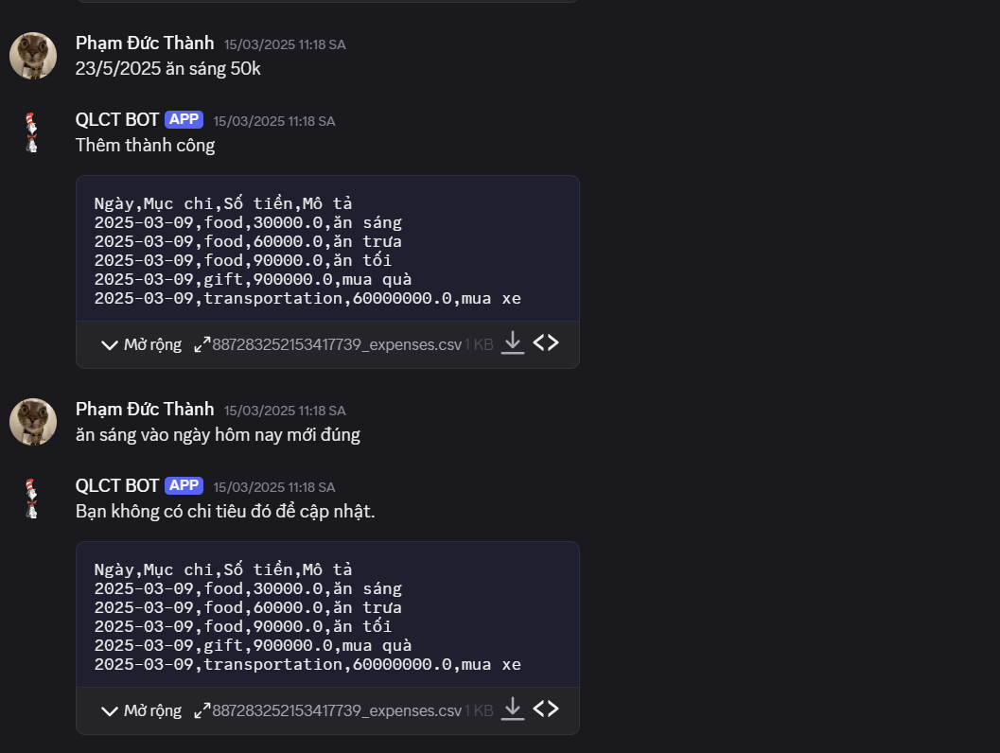

# 🤖 Bot Quản Lý Chi Tiêu - QLCT

Xin chào mọi người! Đây là một dự án nhỏ giúp ghi chép và quản lý chi tiêu hằng ngày thông qua các câu lệnh đơn giản bằng tiếng Việt, ví dụ như: **"23/5/2025 ăn sáng 50k"**.

Dự án chạy trên Google Colab hoặc có thể tích hợp với Bot Discord và GROQ API.

## 🛠️ Hướng dẫn sửa chỗ điền API Key & Bot Token

### 🔑 Điền API Key từ GROQ

Trong đoạn code sau:

```python
api_key = "GROQ_API_KEY"
client = Groq(api_key=api_key)
```

👉 Bạn hãy thay `"GROQ_API_KEY"` bằng API key thật từ GROQ, ví dụ:

```python
api_key = "sk-xxxxxx..."
```

---

### 🤖 Điền Bot Token

Trong đoạn code sau:

```python
async def main():
    await bot.start('BOT_TOKEN')

asyncio.run(main())
```

👉 Hãy thay `'BOT_TOKEN'` bằng token thật của bot bạn, ví dụ:

```python
await bot.start('1234567890:ABC-DEF1234ghIkl-zyx57W2v1u123ew11')
```

---

## 📸 Hình ảnh minh họa

### Bot thêm chi tiêu thành công




---

**Cảm ơn bạn đã sử dụng! Nếu có góp ý, xin hãy để lại phản hồi giúp mình hoàn thiện hơn nhé!**
